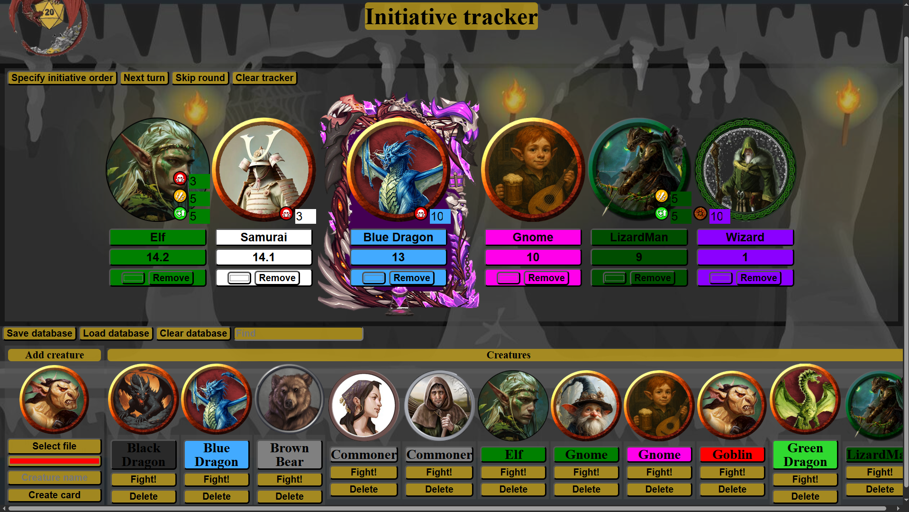

# D&D Initiative Tracker
## Description
This tracker developed for tabletop RPG D&D. Likely use it on big Plazma TV to track your encounters.
This application allow you to automaticaly track turn order of creatures/players, their conditions in fight.
You can easly add your own cretures card using template.
This application intend to show players, so DM may hide creatures stats.

## How to use
  1. Download the zip
  2. Unpack to a PC, that connected to TV or monitor which you want to show the tracker
  3. Open index_eng.html by your browser
  4. Press "Load database" and select base_eng.json
  5. Press "Fight!" on any creature card at the bottom
  6. Enter the value of initiative to input field "Initiative" to every creature in tracker order
  7. Make shure, that all creatures have different initiatives
  8. Press "Specify initiative order" to start encounter
  9. Press "Next turn" when player end his turn

## Features & Tips
  - Automaticaly changing turn by press "Next turn" or "Enter" on keyboard
  - You can track 3 conditions using interface, just hover the cursor over creature icon, it decresses automaticaly when creature skip turn
  - You can save and load list of creatrues on the disk, if you delete base, initiative tracker continiue his work propelry
  - Use fullscreen mode in your browser for better experience
  - Use "Find" at creatures list to fast find what you need
  - Enter only different initiative, if creatures have same, use decimal values, for example: 15.1 and 15.2, of course creature with initiative 15.2 would turn earlier then 15.1
  - You can change color and name of creatures when tracking them
  - Tracker saves it last state, but if you cleaning browser local storage be sure, you have kept your base
  - Keep images of creatures in folder "avatars"

## How to add my own creature?
So easy! 
- Prepare avatar, using template.psd
- Save it only to folder "avatars" (in project folder)
- In left bottom corner of application find "Add creature"
- Press "Select file" and select your avatar
- Input name and select color
- Press "Create card"  
You created your own card! Pay attention application do not save the file on the disk automaticaly and your cards may be lost, you have to save your database.

## Issues
  - application uses local storage of browser, which have limit (basicaly 5-10MB), anycase it save only path to images and some data, so you can load more then 10,000 creatures
  - if application scale shows incorrect, you may change scale in browser

## Compatible browsers
  Google Chrome, Microsoft Edge, Mozilla Firefox

## License
  No license, you can use it however you want.

## Tools<
HTML5, JavaScript, Photoshop, Notepad++
